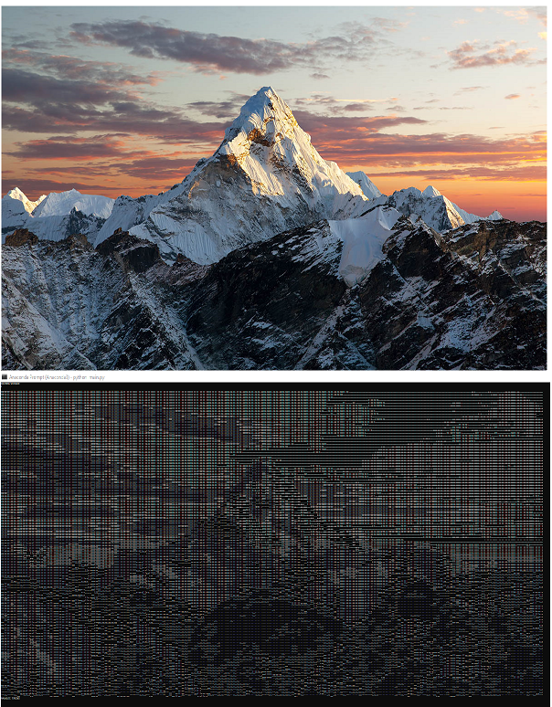
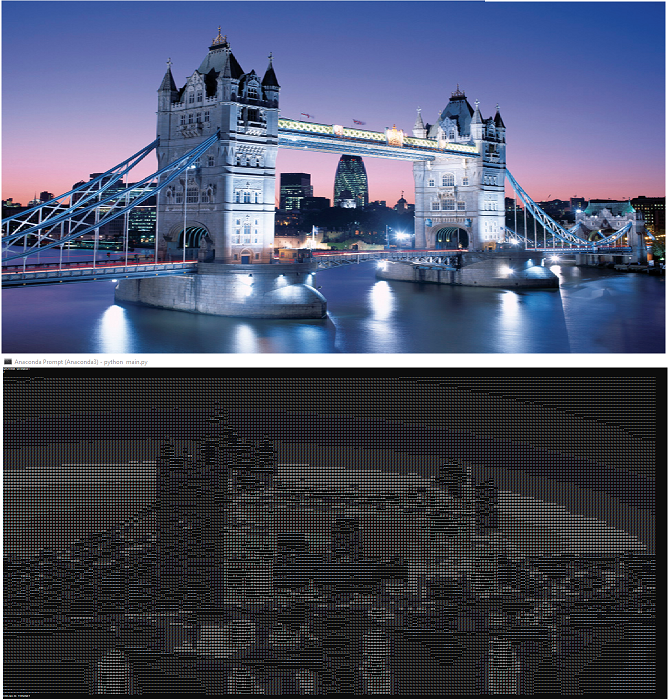
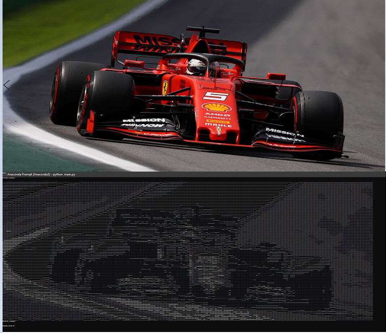

**I tested only at command prompt of Windows 10.**  
**I don't know that if it's going to work at any other shell.**  

**If you like to test the program you might have to find suitable settings for your shell.**  

To run program give absolute path, path from reprository root of the photo or drop it to same directory with the main.py.
And you have to update the "filename" variable of main.py.

You can start it with : python main.py
1. First you need to choose which setting you are going to print. Enter 1,2 or 3.  
2. Then you will be asked do you want inverted brightness. Enter 'y' or 'n'.  
3. Decide that you are going to continue program. Enter 'y' or 'n'.  
4. If yes you will return first option.  

**Couple of examples**:

</img> 

* [2nd option](./examples/ex3.2.png) 
* [3rd option inversed brightness](./examples/ex3.3r.png) 

</img> 

* [2nd option](./examples/ex2.2.png) 
* [3rd option inversed brightness](./examples/ex2.3r.png) 

</img> 

* [1st option](./examples/ex1.1.png) 
* [1st option inversed brightness](./examples/ex1.1r.png) 
* [2nd option](./examples/ex1.2.png) 
* [2nd option inversed brightness](./examples/ex1.2r.png) 
* [3rd option](./examples/ex1.3.png) 
* [3rd option inversed brightness](./examples/ex1.3r.png) 
